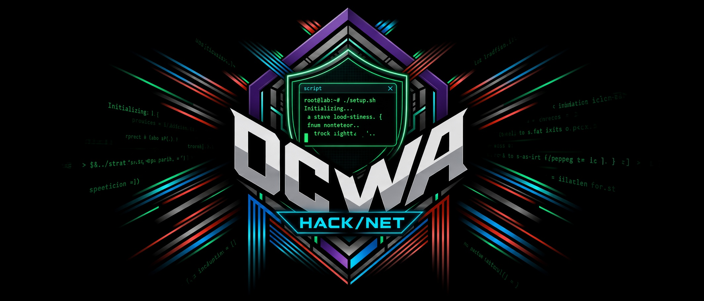
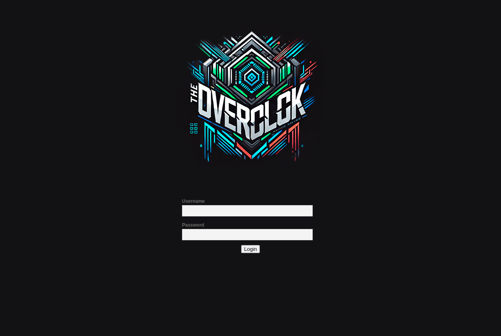

<p align="center">
  
</p>

<h1 align="center">OCWA-Script</h1>

<p align="center">Automated setup for the OCWA web server, the Debian web target of the OVERCLOCK lab.</p>

<p align="center">
  
  
  
  
</p>

---

These scripts stand up the **OCWA** web server for the **OVERCLOCK** offensive-security lab
(the NGS x GCU Hacknet project). One script installs just the vulnerable web application;
the other builds the full lab box, a web-to-root chain with **25 capture-the-flag
objectives** layered on top.

The web application itself lives in the companion repo
[OCWA](https://github.com/0x31i/OCWA). This repo is the installer.

> **This box is intentionally insecure.** Build it only on an isolated VM with no route to
> a production network or the public internet. You are responsible for how and where you
> run it.

---

## Two installers: which one to run

| Script | What it builds | Use it when |
|---|---|---|
| **`Install-OCWA.sh`** | The OCWA web application only: clones OCWA, installs the packages, configures MariaDB, Apache, and PHP. Bilingual output (English / Spanish). | You want just the vulnerable web app to practice web attacks. |
| **`Debian-Setup.sh`** | The full lab box: OCWA plus the layered host-compromise chain (Docker, PostgreSQL, MySQL secrets, SSH keys, cron, service accounts) and all 25 seed-derived flags. | You want the complete graded OVERCLOCK web box, web app through to host root. |

Most of the time you want **`Debian-Setup.sh`** for the real lab experience.

---

## Quick start

On a fresh, isolated Debian 13 VM, as **root**. Snapshot the clean VM first so you can
roll back.

**Full lab box (recommended):**

```bash
sudo bash -c "$(curl --fail --show-error --silent --location https://raw.githubusercontent.com/0x31i/OCWA-Script/main/Debian-Setup.sh)"
```

**Web application only:**

```bash
sudo bash -c "$(curl --fail --show-error --silent --location https://raw.githubusercontent.com/0x31i/OCWA-Script/main/Install-OCWA.sh)"
```

Or clone and run locally:

```bash
git clone https://github.com/0x31i/OCWA-Script.git
cd OCWA-Script
chmod +x Debian-Setup.sh Install-OCWA.sh
sudo ./Debian-Setup.sh          # or ./Install-OCWA.sh for the app only
```

When it finishes, browse to the box's IP to reach the OCWA login page.

<p align="center">
  
</p>

---

## What you will practice

The full box is a web-to-root chain, from the application down to the host:

- **Web application:** OCWA (a DVWA-style app) vulnerabilities, including source-comment
  leaks, weak login, and embedded or encoded secrets.
- **On-host credential recovery:** `~/.netrc`, `~/.git-credentials`, `~/.ssh` key looting,
  world-readable cron scripts, log-file tokens, service `.env` files, legacy password
  backups, base64-in-binary (`strings`), and a weak AES-128-CBC passphrase.
- **Database access:** PostgreSQL customer data and MySQL `internal.secrets` (a monitoring
  key and a Rails `secret_key_base`).
- **Privilege escalation to root:** a looted SSH key into `svc_backup`, `docker` group to
  host root, a root-only sudoers drop-in, localhost API keys, and `/root/root.txt`.

**Flags:** 25 total, split 8 Easy, 11 Medium, 6 Hard.

---

## Requirements

| | |
|---|---|
| **Target VM** | Debian 13, fresh install, **snapshot it first** |
| **Resources** | 2+ vCPU, 2 GB+ RAM, 20 GB disk |
| **Privilege** | Run as **root** |
| **Attacker box** | Kali Linux (or any pentest distro) on the same isolated host-only network |
| **Networking** | Host-only / internal network. **No internet, no production LAN.** |

`Debian-Setup.sh` is best-effort by design (`set -e` is intentionally off): each step
guards its own failures so one non-critical error never aborts the provision before the
flags and database seeding run.

---

## Flags and the build seed

Flags look like `FLAG{CODENAME12345678}` and are **derived, never written to the box**:
the installer emits no plaintext answer key.

```
flag   = FLAG{ codename + 8 digits }
digits = HMAC_SHA256( seed , "ocwa::<key>" )   (folded to 8 digits)
```

The installer reads the seed from the **`OC_FLAG_SEED`** environment variable:

- **Home / practice (recommended): do nothing.** With no seed set, the installer generates
  a random one and prints it. Save it if you want to regenerate your own answer key.
- **Reproducible personal build:** `export OC_FLAG_SEED="my-personal-seed"` before running.

Your home-built flags **will not match the official graded lab**, which uses a private
course seed. The box is fully playable; the official answers are not computable from this
public installer.

---

## Walkthroughs

This repo ships the student writeups for the box. Pick the level of help you want:

| File | Use it when |
|---|---|
| `webserver-student-lite.md` | **Hints only**, no answers. |
| `ocwa-hybrid.md` | Hint **plus** a per-flag collapsible reveal. |
| `webserver-student-walkthrough.md` | Full step-by-step walkthrough. |
| `webserver-student-walkthrough-wiki.md` | Same content, wiki/portal formatting. |

Flag values in the writeups are **masked** (`FLAG{S******8}`), and screenshots have flag
values redacted, so you still recover and submit the real ones from your own box. Some
steps decode tokens with [d3coder](https://github.com/0x31i/d3coder).

---

## Troubleshooting

- **Provision looks incomplete:** the installer is best-effort; rebuild from the clean
  snapshot if the flag env (`/root/.oc_flags.env`) or the database seeding did not
  complete.
- **Cannot reach the site:** confirm Apache and the database are running
  (`systemctl status apache2 mariadb`) and that you are browsing the box's IP over the
  isolated network.
- **Reset the flags:** roll back to the snapshot and rebuild with a different
  `OC_FLAG_SEED`.

---

## Part of the OVERCLOCK lab

- [OCWA](https://github.com/0x31i/OCWA): the web application this installer deploys.
- [VulnWinServer](https://github.com/0x31i/VulnWinServer): the Windows Server 2019 box.
- [VulnWorkstation](https://github.com/0x31i/VulnWorkstation): the Windows 10 workstation.

## License

MIT. For authorized training and education only. Do not deploy on any system or network
you do not own or have explicit permission to test.
